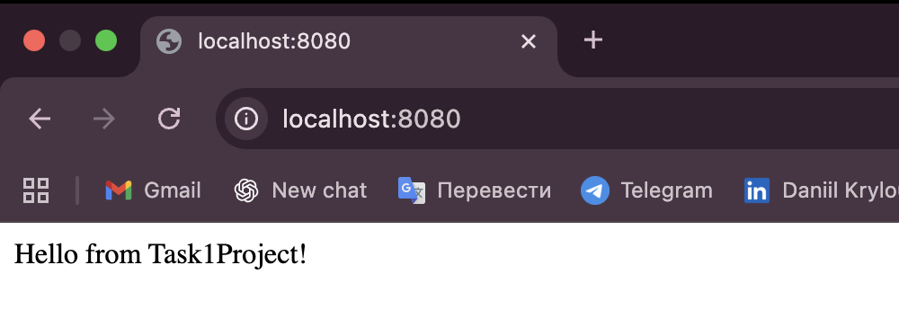
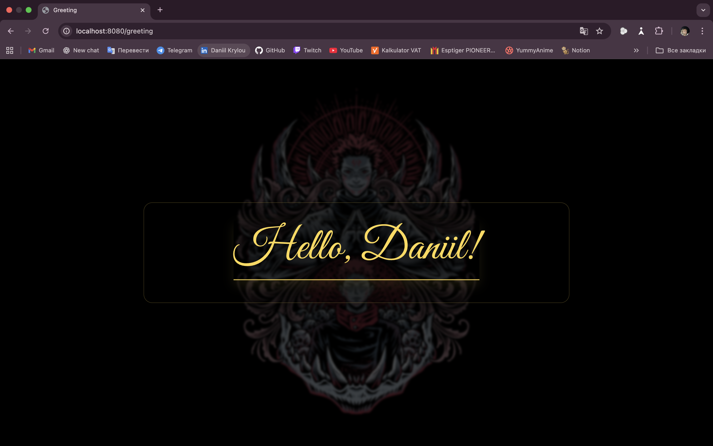
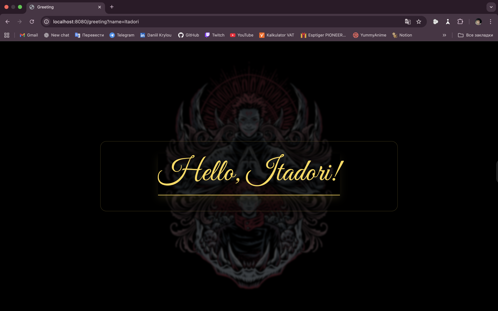

# Task1Project

## Run
- Start app (Task1ProjectApplication)
- Open in browser

## Pages
- Home page: http://localhost:8080
- Greeting page: http://localhost:8080/greeting
- Greeting with name: http://localhost:8080/greeting?name=Itadori

## Screenshots

### Home

### Greeting

### Greeting with name

